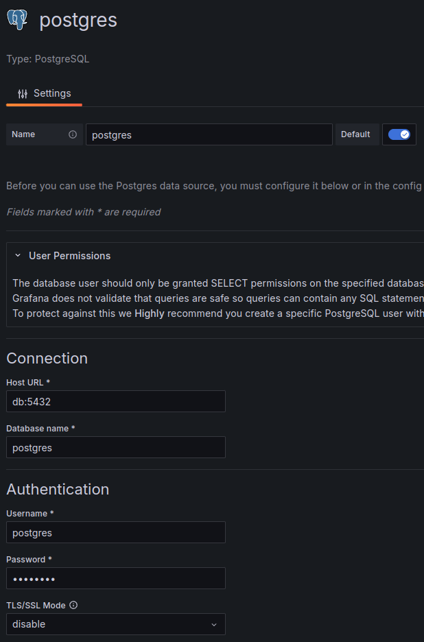

# USPTO Explainable AI

This repository contains my code for the [USPTO - Explainable AI for Patent Professionals](https://www.kaggle.com/competitions/uspto-explainable-ai/overview) competition on Kaggle in which I finished in the 13th place.

Kaggle links:
- Write-up: [kaggle.com/competitions/uspto-explainable-ai/discussion/522359](https://www.kaggle.com/competitions/uspto-explainable-ai/discussion/522359)
- Offline notebook (competition submission): [kaggle.com/code/jmerle/uspto-explainable-ai-ensemble](https://www.kaggle.com/code/jmerle/uspto-explainable-ai-ensemble)
- Online notebook (dependencies): [kaggle.com/code/jmerle/uspto-explainable-ai-ensemble-dependencies](https://www.kaggle.com/code/jmerle/uspto-explainable-ai-ensemble-dependencies)
- Reformatted competition data dataset: [kaggle.com/datasets/jmerle/uspto-explainable-ai-reformatted-patent-data](https://www.kaggle.com/datasets/jmerle/uspto-explainable-ai-reformatted-patent-data)
- Full search index dataset: [kaggle.com/datasets/jmerle/uspto-explainable-ai-full-search-index](https://www.kaggle.com/datasets/jmerle/uspto-explainable-ai-full-search-index)
- Original submission notebook (before switching to C++): [kaggle.com/code/jmerle/uspto-explainable-ai](https://www.kaggle.com/code/jmerle/uspto-explainable-ai)

I started out in Python, and managed to get a public score of 0.53 using basic frequent pattern mining as seen in the [`python/original-submission.ipynb`](./python/original-submission.ipynb) notebook.

In experiments, I noticed that looking up the full data for random patents was extremely time-consuming, especially when that data would include descriptions. This turned out to be caused by the Parquet patent data files containing only a single row groups, making it required to read and decompress entire files even when only needing the data for a single patent.

Around the same time I started thinking about the possibility of creating a search index and running queries against it in my submission notebook. This would make it possible to select the best query out of an array of generated queries for each row in the test dataset. However, generating a search index with Whoosh takes quite a lot of time.

Based on those findings I came up with the following plan:
1. Extract the compressed patent data from the Parquet files, tokenize their contents, and store the tokens to disk in a format optimized for my solution. This should allow for fast random patent lookup, and fast lookup of a subset of a patent's fields (e.g. only retrieve the CPC and title tokens without parsing the tokens of other fields).
2. At submission time, create an index containing patents that are most likely present in the test index. Assume all targets are present, and then gradually add popular neighbors of patents already in the index until the index contains 200k patents.  
   The index should store a bitset for each possible term denoting the patents that match it. Only consider `<category>:<token>` terms such as "ti:method" or "detd:algorithm" to limit the size of the index. Using such an index we can efficiently execute all queries using such terms with OR, AND, NOT, and XOR operators.  
   This format does not support proximity operators, wildcards, multi-word terms, and uncategorized terms. However, my earlier public score 0.53 submission only used single-word title terms and CPC terms with OR, AND, and XOR operators, so I'm confident that the supported subset is enough to get a competitive leaderboard score.
3. Create a bunch of query builders and use them to generate possible queries for each row in the test dataset, with per-query hyperparameter optimization where necessary. Run each generated query against the index created in step 2, and submit the one with the best result.

Along with this plan I decided to switch to C++ for optimal performance. Kaggle notebooks run in an environment with GCC and CMake installed, so we can compile and run C++ code at submission time. Dependencies are pre-installed in a separate notebook and added through a private dataset.

## Usage

Building all executables in release mode:
```sh
# Install Python dependencies
$ pip install -U -r requirements.txt

# Install C++ dependencies
$ conan install . --build=missing

# Navigate to the build directory (created by Conan)
$ cd build

# Generate Makefile
$ cmake .. -DCMAKE_BUILD_TYPE=Release -DCMAKE_TOOLCHAIN_FILE=Release/generators/conan_toolchain.cmake

# Build all targets
$ make -j
```

All executables must be executed with the following environment variables set when running locally:
- `COMPETITION_DATA_DIRECTORY`: path to the directory containing the competition data. For example, `COMPETITION_DATA_DIRECTORY/patent_metadata.parquet` and `COMPETITION_DATA_DIRECTORY/patent_data/2023_6.parquet` must be valid files.
- `VALIDATION_DATA_DIRECTORY`: path to the directory containing the data in the [USPTO-explainable-ai-validation-index](https://www.kaggle.com/datasets/devinanzelmo/uspto-explainable-ai-validation-index/data) dataset by Devin Anzelmo.
- `PROJECT_DIRECTORY`: path to the directory containing this project.
- `OUTPUT_DIRECTORY`: path to the directory where the executables write their data to.

The following executables are available:
- `reformat-patent-data`: extracts the patent data from the compressed Parquet files, tokenizes their contents, and stores the tokens to disk in `OUTPUT_DIRECTORY/patents`. Generates around 115GB of data in approximately 2 hours and 15 minutes on my personal laptop, a Lenovo Thinkpad T14 Gen 1 containing an AMD Ryzen 7 PRO 4750U CPU and 32GB of RAM.
- `create-full-index`: creates a search index for the full dataset to `OUTPUT_DIRECTORY/full-index`.
- `create-validation-index`: creates a search index for the validation dataset to `OUTPUT_DIRECTORY/validation-index`.
- `run-submission`: generates queries for all rows in the `test.csv` file and saves the best query for each row to `submission.csv`. This code runs in submissions.
- `tests`: runs the unit tests.
- `test-searcher`: runs 103 queries with my custom searcher to test its accuracy and performance. These queries were first executed using Whoosh against Devin Anzelmo's validation index. Requires `create-validation-index` to be executed at least once before.
- `test-submission`: simulates a submission on the first 2,500 rows in Devin Anzelmo's validation dataset's `neighbors_small.csv` file. Requires `create-full-index` to be executed at least once before.

The submission notebooks are created by the [`python/generate_submission_notebook.py`](./python/generate_submission_notebooks.py) script.

## Grafana configuration

When building the `run-submission` or `test-submission` executables with the `GRAFANA_ENABLED` CMake option enabled, the executable assumes you're running Grafana and PostgreSQL with the configuration in [`docker-compose.yml`](./docker-compose.yml).

The Grafana username and password are both "admin". After logging in for the first time, create a PostgreSQL data source using this configuration (leave the rest of the properties at their defaults):


Then, go to Dashboards > New > Import and import the [grafana/submission-monitoring.json](./grafana/submission-monitoring.json) dashboard. With this configuration you'll see a dashboard like this while running the `run-submission` or `test-submission` executables locally:

